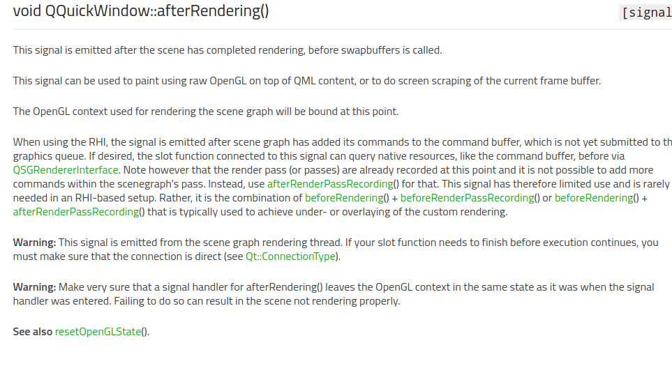

# qt统计送显频率  

## 概述     

在进行QML刷新频率时，需要知道渲染后的画面送入显卡的频率。从而更加准确的知道，刷新频率。因此，介绍一下送显频率的统计方式。

## 实现原理    

在用Qt统计送显频率的时候，可以在Qt函数库中找到一个信号的说明如下：

## 参考资料    

1. http://www.voidcn.com/article/p-eqoecdmu-btr.html   

