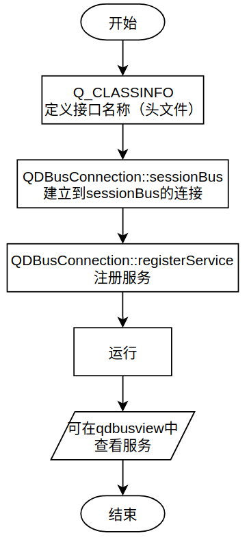
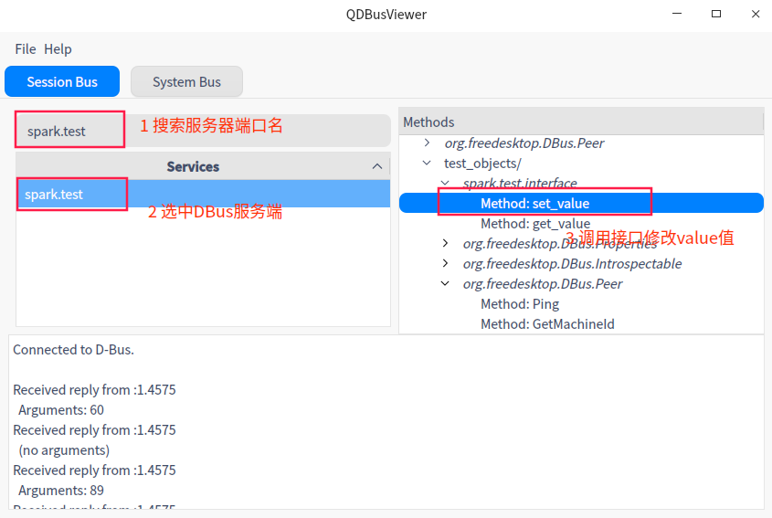
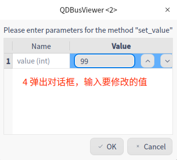
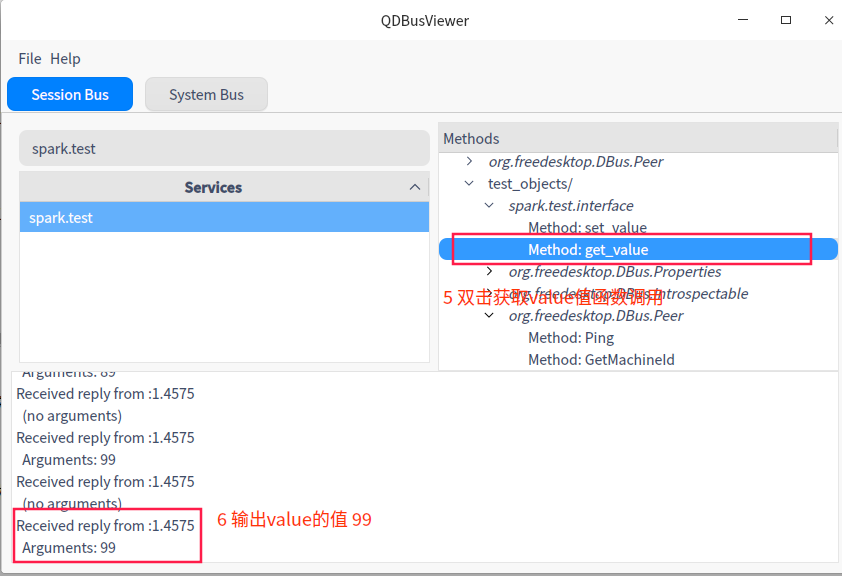
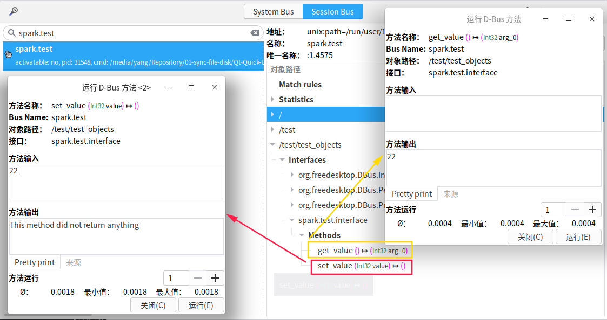

# [基于Qt的DBus信号的用法-下](./)  [img](./img)     

> ######  _标签:_     [](https://www.cnblogs.com/sparkFY/p/14973726.html) [](../03-code/)        
>

## 1 QtDBus编程    

分为两个部分，DBus服务和访问DBus服务。   

### 1.1 创建服务   


<center>
  
</center>
代码如下： 

```C++
// test.h
#ifndef TEST_H
#define TEST_H
#include <QObject>
#include <QtDBus>

class test: public QObject
{
    Q_OBJECT
// 这里定义的是DBus连接的接口，client需要这个"spark.test.interface"接口对DBus服务进行访问。
    Q_CLASSINFO("D-Bus Interface", "spark.test.interface")
public:
    test(int value);

public slots:
    void set_value(int value);
    int get_value();
private:
    int m_value;
};

#endif // TEST_H
```

```C++
// test.cpp
#include "test.h"

test::test(int value)
{
    m_value = value;
}

void test::set_value(int value)
{
    m_value = value;
}

int test::get_value()
{
    return m_value;
}
```

```C++
// main.cpp
#include <QCoreApplication>
#include <QDBusConnection>
#include <QDebug>
#include <QDBusError>
#include "test.h"

int main(int argc, char *argv[])
{
    QCoreApplication a(argc, argv);

    // 建立到session bus的连接
    QDBusConnection connection = QDBusConnection::sessionBus();
    // 在session bus上注册名为spark.test的服务
    // spark.test是服务的名字，注意和test.h中的接口名字spark.test.interface区别
    if(!connection.registerService("spark.test"))
    {
        qDebug() << "error:" << connection.lastError().message();
        exit(-1);
    }
    test test_object(60);
    // 注册名为/test/test_objects的对象，把类Object所有槽函数导出为object的method
    connection.registerObject("/test/test_objects", &test_object, QDBusConnection::ExportAllSlots);
    
    return a.exec();
}
```

### 1.2 qdbusviewer访问服务  

通过qdbusviewer访问D-Bus服务的

1. 搜索D-Bus服务接口名  
2. 查找注册的对象  
3. 调用对象的接口  

<center>
  
</center>

<center>
  
</center>

<center>
  
</center>

### 1.3 D-Feet访问服务   

使用D-Feet访问效果类似：

<center>
  
</center>
